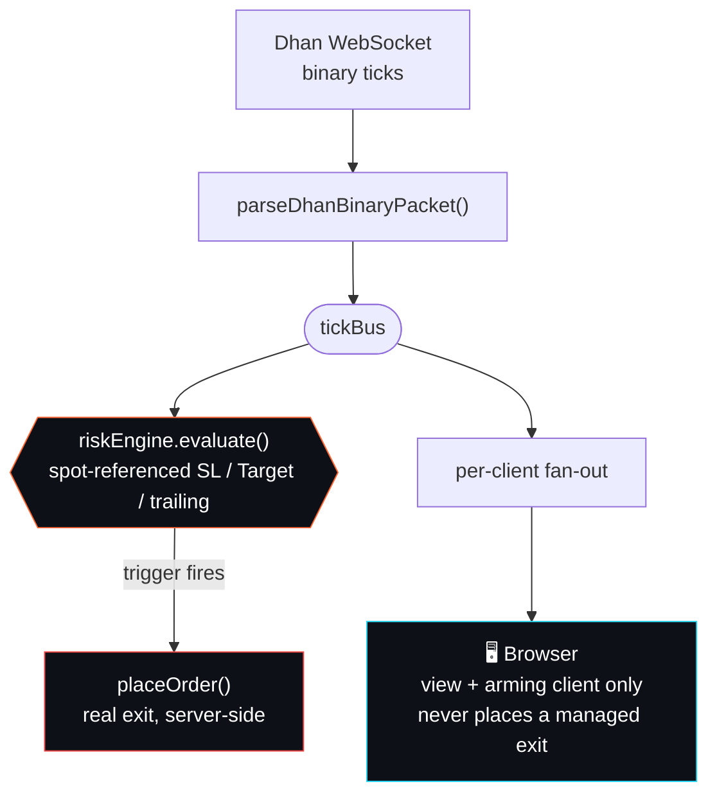
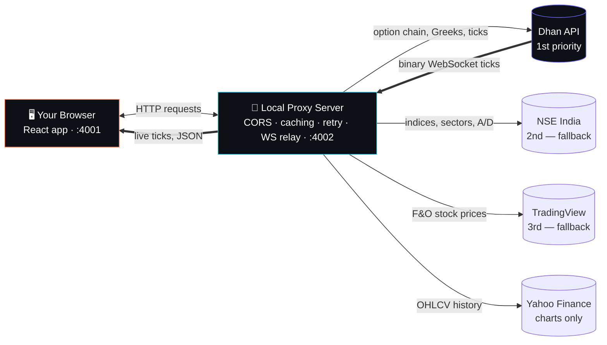
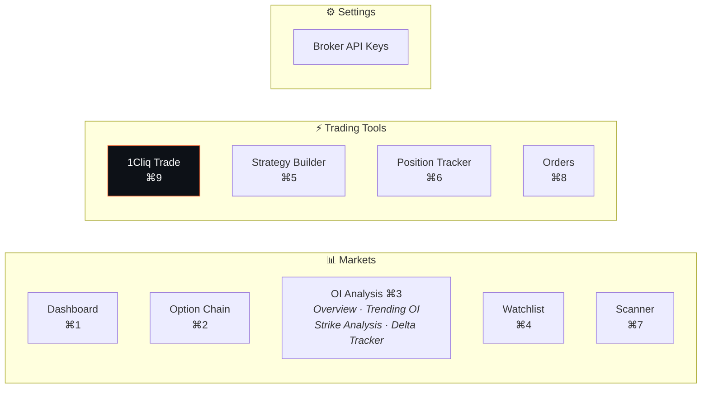
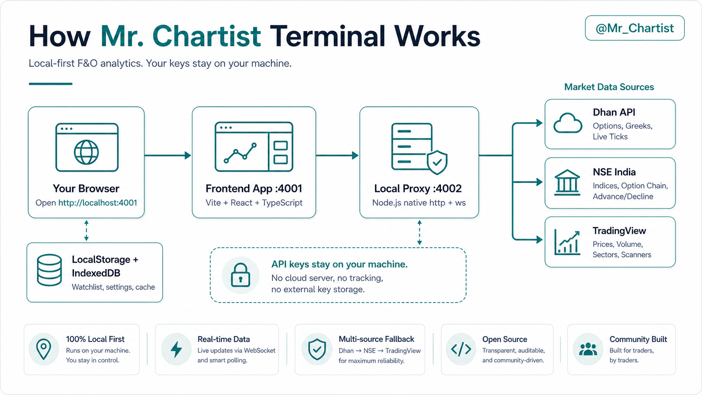

<div align="center">

**India's most comprehensive open-source Options & Futures analytics terminal.**

Built for NSE F&O traders who want a polished, institutional-style terminal -- free, open-source, and running in your browser.

Built by [**Mr. Chartist**](https://github.com/MrChartist) | Part of the [Mr. Chartist Ecosystem](https://mrchartist.com)

[](https://react.dev)
[](https://typescriptlang.org)
[](https://vitejs.dev)
[](https://tailwindcss.com)
[](LICENSE)
[](https://github.com/MrChartist/india-s-best-option-hub/pulls)

[Preview](#preview) · [Simple Setup](#start-here-no-coding-experience-needed) · [Features](#-what-you-get) · [1Cliq Trade Terminal](#-1cliq-trade-terminal) · [Quick Start](#-quick-start-5-minutes) · [Data Sources](#-data-sources) · [Contributing](#-contributing)

</div>

---

> **🚀 v1.0 — Actively Maintained**
>
> Core features are stable and production-ready. 33 Indian brokers now have real backend option-chain/expiry/connection support (bring your own API key) — see the [Roadmap](#-current-status--roadmap) for what's next.
>
> **New: 1Cliq Trade terminal** (`/one-cliq`) — a keyboard-driven, arrow-key one-click execution terminal inspired by dedicated scalping tools, with a full arming model, spot-referenced SL/Target math, and a real fill simulator. See [1Cliq Trade Terminal](#-1cliq-trade-terminal) below.
>
> Runs locally on your own machine. No hosting, no cloud database, and no required broker key for the basic dashboard experience.
>
> **Fork it, build on it, make it yours!** MIT licensed. If something doesn't make sense, use Claude/ChatGPT/Gemini to inspect the code, understand the flow, and iterate safely.

---

## Preview

<details open>
<summary><strong>🌙 Dark Mode — Market Dashboard</strong></summary>


</details>

<details>
<summary><strong>☀️ Light Mode — Dashboard</strong></summary>


</details>

<details>
<summary><strong>Polished Compact Navigation</strong></summary>


</details>

<details>
<summary><strong>🌙 Dark Mode — Option Chain</strong></summary>


</details>

<details>
<summary><strong>☀️ Light Mode — OI Analysis</strong></summary>


</details>

<details>
<summary><strong>☀️ Light Mode — Strategy Builder</strong></summary>


</details>

<details>
<summary><strong>🌙 Dark Mode — Broker Settings</strong></summary>


</details>

---

## 🧠 What Is This?

This is a **free, browser-based Options & Futures analytics terminal** for the Indian stock market (NSE).

**Think of it as your personal trading dashboard** that shows:
- Live prices of NIFTY, BANKNIFTY, and other indices
- Full option chain with OI (Open Interest), IV (Implied Volatility), and Greeks
- Charts showing where the smart money is positioned
- Tools to build and test trading strategies before risking real money

**Who is this for?**
- 📈 **Options traders** who want professional tools without paying ₹2000+/month
- 🎓 **Beginners** learning about option chains, OI analysis, and Greeks
- 💻 **Developers** who want to build on top of a solid F&O analytics platform
- 🧪 **Builders and learners** who want a real-world project to study, customize, and improve

---

## Start Here (No Coding Experience Needed)

You only need three things: **Node.js**, this project folder, and a browser. The app runs on your own computer, so you do not need to buy hosting or deploy anything.

### Windows PC

1. Install **Node.js LTS** from [nodejs.org](https://nodejs.org/).
2. Download this project as a ZIP from GitHub and extract it, or clone it with Git.
3. Open the extracted project folder.
4. Click the folder address bar, type `cmd`, and press **Enter**. A terminal opens inside the project.
5. Run `npm install`.
6. Run `npm run dev`.
7. Open `http://localhost:4001` in Chrome, Edge, or Brave.

### Mac

1. Install **Node.js LTS** from [nodejs.org](https://nodejs.org/).
2. Download this project as a ZIP from GitHub and unzip it, or clone it with Git.
3. Open **Terminal**.
4. Type `cd `, drag the project folder into Terminal, and press **Enter**.
5. Run `npm install`.
6. Run `npm run dev`.
7. Open `http://localhost:4001` in Safari, Chrome, or Brave.

Keep the terminal window open while using the dashboard. To stop the app, click the terminal and press `Ctrl+C`.

You can use the basic dashboard without broker credentials. Add a free Dhan API key only if you want the best option-chain, Greeks, and live tick experience.

---

## ✨ What You Get

| Feature | What It Does | Status |
|---------|-------------|--------|
| **📊 Live Dashboard** | Real-time NIFTY, BANKNIFTY prices, VIX, sector heatmap, market sentiment score | ✅ Working |
| **⛓️ Option Chain** | Full strike-wise data — LTP, OI, OI Change, Volume, IV for every CE/PE strike | ✅ Working |
| **📈 OI Analysis** | ATM zone, OI heatmap, support/resistance, delta tracking, and IV/PCR modules across 4 focused pages | ✅ Working |
| **⚡ 1Cliq Trade Terminal** | Keyboard-driven one-click execution — arrow-key order entry, spot-referenced SL/Target, arming model, fill simulator | 🧪 Beta (paper-first) |
| **🧮 Strategy Builder** | Build Bull Call Spread, Iron Condor, Straddle — see payoff chart before you trade | ✅ Working |
| **💼 Position Tracker** | Track your open positions with real-time P&L | ✅ Working |
| **📋 Orders** | Live order book (Dhan) with cancel support, alongside the app's simulated paper trades | ✅ Working |
| **⭐ Watchlist** | Save your favorite stocks for quick access | ✅ Working |
| **📡 Futures Scanner** | Real OI buildup/covering signals, volume, basis & rollover across index + full F&O stock universe | ✅ Working |
| **🔑 Broker API Keys** | Connect your own broker account for live data (BYOK) — 33 brokers supported | ✅ Working |
| **📡 WebSocket Live Feed** | Real-time price ticks via Dhan WebSocket binary protocol | ✅ Working |
| **🗄️ Local Database** | IndexedDB-based persistence for price snapshots and candle history | ✅ Working |
| **📥 Chart Downloader** | Batch download OHLCV candles via Yahoo Finance (free, no API key) | ✅ Working |

> **Live Trading is off by default everywhere.** Buy/Sell actions place simulated paper trades until you explicitly flip the "Live Trading" toggle (Broker Settings or the Option Chain header) and acknowledge a real-money warning. See [Disclaimer](#️-disclaimer).

### Dashboard Sections

The dashboard is packed with live data widgets:

- **Index Cards** — NIFTY 50, BANK NIFTY, FINNIFTY, MIDCAP NIFTY with live prices & intraday sparklines
- **Data Sources Bar** — Real-time status of all 6 data sources (Dhan API, Dhan WS, Live Feed, NSE, TradingView, VIX)
- **Key Metrics** — PCR, VIX, Max Pain for NIFTY and BANKNIFTY
- **Expected Move** — How much NIFTY/BANKNIFTY might move before expiry, from each index's own real ATM IV
- **Futures Buildup Scanner** — Top real Long/Short Buildup signals from the full F&O universe, linking to the full `/scanner` page
- **FII/DII Activity** — Latest institutional cash-market net buy/sell, published by NSE after each session
- **Top Movers** — Today's biggest gainers and losers in F&O
- **Futures & VIX** — Premium/Discount analysis and VIX trend charts
- **Sector Performance** — Color-coded sector heatmap showing money flow
- **Most Active F&O** — Stocks with highest trading activity + OI interpretation
- **Market Breadth** — Overall market health score, Advance/Decline ratio, VIX regime

---

## ⚡ 1Cliq Trade Terminal

A dedicated, keyboard-first execution terminal at `/one-cliq` (⌘9 / Ctrl+9), inspired by the fast-execution terminals professional scalpers use — built because 1Cliq-style tools run their trailing-stop logic in the browser tab, so closing the tab or losing the connection silently kills every automation. This app's architecture is designed to move that logic server-side instead (see [`1CLIQ-TRADE-SPEC.md`](1CLIQ-TRADE-SPEC.md) for the full build spec and roadmap).

**The core architectural idea — the risk engine lives on the server, not in a browser tab:**



The risk engine evaluates **before** the browser fan-out, so an exit is never late because a UI tab was slow, backgrounded, or closed — the single-writer server state machine is what a closed laptop lid can't defeat. (This is the target architecture from the spec; check the phase checklist below for what's actually wired end-to-end today.)

**Shipped (paper-first terminal shell):**
- Full CE / spot / PE strip with day-range meters, arrow-key strike stepping, and lot presets
- Complete keyboard layer — arrow keys for market orders, `+`/`-` for lot size, `F6`/`F7` for close-all/cancel-all, `O` to arm one-click, `Esc` to disarm — scoped so it never breaks the app's existing shortcuts (`/`, `⌘K`, `⌘1`–`⌘9`)
- An explicit arming model: one-click execution requires Live Trading to be on **and** a deliberate arm action **and** the terminal to be focused, auto-disarms after 90s idle, and never persists across a reload
- A realistic fill simulator (bid/ask-aware, slippage, latency) so paper trades feel like real order flow, not instant LTP fills
- Honest partial-exit handling — a 25% exit that rounds to less than one lot is disabled with an explanation, never silently rounded up

**Shipped (server-side risk & panic infrastructure):**
- A real server-side risk engine (`server/lib/riskEngine.mjs`) — spot-referenced SL/Target math, a trailing-stop ratchet, and a position state machine, all running server-side with a 1s dead-man's-switch heartbeat so the calculation survives a closed browser tab. The armed-status badge in the terminal renders **only** from that server heartbeat, never optimistic client state. **Real order placement is not wired into this engine yet** — it calls an injectable stub, so this is the risk *calculation* running server-side, not yet a live exit.
- A three-wave panic layer (`server/lib/panicLayer.mjs`) wired to real Dhan calls: `F6`/`F7` in live mode hit real `panic-close-all`/`panic-cancel-all` endpoints that fetch your actual open positions/orders from Dhan, close shorts-then-longs-then-futures with a hard barrier between waves, and only report success after re-fetching and confirming the book is actually empty.
- A trading lock (`unlocked` / `locked-by-user` / loss-triggered states) with a 10-minute cooling-off + typed-confirmation ritual to clear a loss lock — computed server-side, not from client-supplied timers.
- Portfolio read endpoints (`positions`, `holdings`, `funds`, `trades`, `modify-order`) added to the proxy server — not yet wired to any page's UI.
- A basket/tranche resolution engine (`server/lib/basketEngine.mjs`) plus a "Save as Basket" button in Strategy Builder that previews which legs are live-ready before saving — resolves and reports, **does not place orders**.
- Broader broker order support: Dhan (live-verified), the Noren family — Flattrade/Shoonya/TradeSmart/Zebu (implemented, unverified against a live account), and Zerodha/Fyers (implemented against live-verified API docs). Alice Blue/5paisa/Kotak Neo remain data-only for now.

> **This build went through an adversarial correctness audit before merging**, specifically checking for the money-losing failure modes `1CLIQ-TRADE-SPEC.md` §13 calls out. The audit caught a real one — the panic-close-all/cancel-all endpoints could be made to trust a client-supplied position list instead of always re-fetching from Dhan, which would have bypassed lot-size validation entirely. **That's fixed** (the endpoints now always use the fresh broker fetch), along with two related hardening fixes to the panic layer's success reporting and the trading-lock cooling-off timer. A separate audit of the older, already-shipped order-placement path (the plain "Live Trading" toggle on Option Chain, not the 1Cliq terminal) found that path is currently non-functional due to a CORS configuration gap — which means it fails safe today, but the fix needs a proper server-side session-arming design, not a quick patch, so it's tracked as open rather than rushed.

**Still not wired end-to-end:** the risk engine's SL/Target exits and the basket engine's deploy step don't place real orders yet — both are the calculation/resolution layer only. Treat the 1Cliq terminal as paper-only for actual execution until that lands. Track exact status in `1CLIQ-TRADE-SPEC.md`'s roadmap (§11).

---

## 🚀 Quick Start (5 Minutes)

### Prerequisites

| Tool | Version | Download |
|------|---------|----------|
| **Node.js** | v18 or higher | [nodejs.org](https://nodejs.org/) |
| **Git** | Any recent version | [git-scm.com](https://git-scm.com/downloads) |
| **Code Editor** | Optional but recommended | [VS Code](https://code.visualstudio.com/) |

> **New to coding?** Don't worry! Just follow the steps below. If you get stuck, copy the error message and ask ChatGPT/Claude/Gemini for help.

### Step 1: Clone the Repository

**Option A: Using Git (recommended)**

Open your terminal (Command Prompt, PowerShell, or Terminal on Mac/Linux) and run:

```bash
git clone https://github.com/MrChartist/india-s-best-option-hub.git
cd india-s-best-option-hub
```

**Option B: Download ZIP (no Git needed)**

1. Go to [github.com/MrChartist/india-s-best-option-hub](https://github.com/MrChartist/india-s-best-option-hub)
2. Click the green **"Code"** button → **"Download ZIP"**
3. Extract the ZIP file to any folder
4. Open a terminal in that folder

### Step 2: Install Dependencies

```bash
npm install
```

This downloads all the libraries the project needs. Wait for it to finish (~1-2 minutes on first install).

> **Getting errors?** Make sure Node.js is installed by running `node --version`. You should see `v18.x.x` or higher. If not, [download Node.js](https://nodejs.org/).

### Step 3: Start the App

```bash
npm run dev
```

This starts **two servers simultaneously**:

| Server | URL | Purpose |
|--------|-----|---------|
| **Vite** (frontend) | `http://localhost:4001` | The React app you see in the browser |
| **Proxy** (data relay) | `http://localhost:4002` | Routes data from Dhan/NSE/TradingView |

**Open your browser and go to:** `http://localhost:4001`

🎉 **That's it!** You should see the dashboard loading. During market hours (Mon–Fri, 9:15 AM – 3:30 PM IST), live data from TradingView and NSE will populate automatically — no API key needed for basic data.

### What Works Without API Keys

| Works immediately | Needs optional Dhan key |
|-------------------|-------------------------|
| Dashboard overview, index cards, watchlist, sector flow, scanners, and many fallback data widgets | Full Dhan option chain, Greeks, expiry metadata, and live WebSocket ticks |
| Local settings, local watchlist, browser storage, and theme preferences | Highest-quality real-time derivatives data |
| Yahoo Finance historical candle downloads | Broker-specific authenticated endpoints |

### Step 4 (Optional): Add Dhan API for Premium Data

For the best experience (real-time option chain, Greeks, live WebSocket ticks):

1. **Create a Dhan account** at [dhan.co](https://dhan.co) (free)
2. **Get API credentials** from [Dhan Developer Portal](https://dhanhq.co/docs/v2/)
3. **Create a `.env` file** in the project root:

```bash
# Windows
copy .env.example .env

# Mac/Linux
cp .env.example .env
```

4. **Add your credentials** to `.env`:

```env
DHAN_CLIENT_ID=your_client_id_here
DHAN_ACCESS_TOKEN=your_access_token_here
```

5. **Restart the app** (press `Ctrl+C` to stop, then run `npm run dev` again)

The proxy server will automatically detect your Dhan credentials and connect to the Dhan WebSocket for live ticks.

> **📝 Note:** You can also add Dhan credentials from the UI itself — go to **Broker Settings** page (`/broker-settings`) and enter your keys there. They're stored in your browser's localStorage and never sent to any external server.

### Step 5 (Optional): Add Other Broker Keys

The Broker Settings page supports entering API keys for **33 Indian brokers** — each with real backend option-chain, expiry-list, and connection-test support (see `server/brokers/registry.mjs` for the full list). Highlights:

| Broker | Status |
|--------|--------|
| **Dhan** | ✅ Fully integrated (Option Chain, Greeks, WebSocket, Futures Scanner) |
| **Zerodha (Kite)** | ✅ Option chain, expiry list, LTP |
| **Angel One (SmartAPI)** | ✅ Option chain, expiry list, LTP (auto TOTP login) |
| **Upstox** | ✅ Option chain, expiry list, LTP |
| **Fyers** | ✅ Option chain, expiry list, LTP |
| **5paisa** | ✅ Option chain, expiry list, LTP |
| **Alice Blue** | ✅ Option chain, expiry list, LTP (WebSocket quotes) |
| **+26 more** | Zebu, Shoonya, Flattrade, Kotak, Groww, Paytm, HDFC Sky, and others — see Broker Settings for the full list |

The Futures Scanner and dashboard-wide index/sector data always use Dhan → NSE regardless of your active broker, since those are bulk/multi-symbol feeds better served by a full-universe data source than any single broker's per-symbol quote API.

---

## ## 🐳 Running with Docker (No Local Setup Required)

You can run the entire application using Docker without installing Node.js or any dependencies on your system.

---

### ✅ Prerequisites

* Install **Docker Desktop**
* Ensure Docker is running

Verify:

```bash
docker --version
```

---

### 🚀 Quick Start

#### 1. Clone the repository

```bash
git clone https://github.com/MrChartist/india-s-best-option-hub.git
cd india-s-best-option-hub
```

---

#### 2. Build the Docker image

```bash
docker build -t option-hub .
```

Sample Output:
```aiignore
[+] Building 87.4s (10/10) FINISHED                                                                                                                                                                                                                      docker:desktop-linux
 => [internal] load build definition from Dockerfile                                                                                                                                                                                                                     0.0s
 => => transferring dockerfile: 294B                                                                                                                                                                                                                                     0.0s
 => [internal] load metadata for docker.io/library/node:18                                                                                                                                                                                                               2.1s
 => [internal] load .dockerignore                                                                                                                                                                                                                                        0.0s
 => => transferring context: 144B                                                                                                                                                                                                                                        0.0s
 => [1/5] FROM docker.io/library/node:18@sha256:c6ae79e38498325db67193d391e6ec1d224d96c693a8a4d943498556716d3783                                                                                                                                                         0.0s
 => => resolve docker.io/library/node:18@sha256:c6ae79e38498325db67193d391e6ec1d224d96c693a8a4d943498556716d3783                                                                                                                                                         0.0s
 => [internal] load build context                                                                                                                                                                                                                                        0.0s
 => => transferring context: 7.42kB                                                                                                                                                                                                                                      0.0s
 => CACHED [2/5] WORKDIR /app                                                                                                                                                                                                                                            0.0s
 => CACHED [3/5] COPY package*.json ./                                                                                                                                                                                                                                   0.0s
 => [4/5] RUN rm -rf node_modules package-lock.json     && npm install --force                                                                                                                                                                                          75.2s
 => [5/5] COPY . .                                                                                                                                                                                                                                                       0.1s 
 => exporting to image                                                                                                                                                                                                                                                   9.9s 
 => => exporting layers                                                                                                                                                                                                                                                  7.4s 
 => => exporting manifest sha256:75e3c113eac8c8dcc0ec769ec51bdfb5767ce0883609fe46f7ee57d983af34bb                                                                                                                                                                        0.0s 
 => => exporting config sha256:e8dfd38c4b9b20bb6f764db17b5a0c770d80d79ef0fa696956fd6f14a7195eaa                                                                                                                                                                          0.0s 
 => => exporting attestation manifest sha256:f65b10ee21b3422cab3fa8ba6596aed9a79262d011e0e87187cdaa28bde88f12                                                                                                                                                            0.0s 
 => => exporting manifest list sha256:5ccf075f6e80ce19f175629b38be8df5b4a010110a079c3ed06228c1182029d9                                                                                                                                                                   0.0s
 => => naming to docker.io/library/option-hub:latest                                                                                                                                                                                                                     0.0s
 => => unpacking to docker.io/library/option-hub:latest                                                                                                                                                                                                                  2.4s

View build details: docker-desktop://dashboard/build/desktop-linux/desktop-linux/q8ak3rr7fs3kwdwy7u8e48itu
```

Verify generated build image:
```aiignore
docker images | grep option-hub
```

Sample Output
```aiignore
option-hub                            latest    d906950fcb94   About a minute ago   2.24GB
```
---

#### 3. Run the container

```bash
docker run -p 4001:4001 -p 4002:4002 option-hub
```

Sample Output
```aiignore

> india-s-best-option-hub@1.0.0 dev
> concurrently -n vite,proxy -c cyan,green "vite" "node proxy-server.mjs" --host

[proxy] 
[proxy]   🚀 Mr. Chartist Proxy Server
[proxy]   ├─ HTTP:       http://localhost:4002
[proxy]   ├─ WebSocket:  ws://localhost:4002/ws
[proxy]   ├─ Health:     http://localhost:4002/health
[proxy]   ├─ Dhan (1°):  http://localhost:4002/api/dhan-proxy?endpoint=option-chain&symbol=NIFTY
[proxy]   ├─ NSE  (2°):  http://localhost:4002/api/nse-proxy?endpoint=indices
[proxy]   └─ TV Scanner: http://localhost:4002/api/tv-scan?type=stocks
[proxy] 
[proxy]   Data Priority: Dhan → NSE → TradingView
[proxy]   Dhan credentials: ⚠️  Not set (configure in .env or Broker Settings)
[proxy] 
[vite] 
[vite]   VITE v5.4.21  ready in 83 ms
[vite] 
[vite]   ➜  Local:   http://localhost:4001/
[vite]   ➜  Network: http://172.17.0.2:4001/
[proxy] [Proxy Error] /api/dhan-proxy: DHAN_CLIENT_ID or DHAN_ACCESS_TOKEN not configured. Add them to .env or pass via headers.
[proxy] [Proxy Error] /api/dhan-proxy: DHAN_CLIENT_ID or DHAN_ACCESS_TOKEN not configured. Add them to .env or pass via headers.
[proxy] [Proxy Error] /api/dhan-proxy: DHAN_CLIENT_ID or DHAN_ACCESS_TOKEN not configured. Add them to .env or pass via headers.
[proxy] [Proxy Error] /api/dhan-proxy: DHAN_CLIENT_ID or DHAN_ACCESS_TOKEN not configured. Add them to .env or pass via headers.
[proxy]   🌐 Browser WebSocket client connected
```

---

#### 4. Open in browser

```
http://localhost:4001
```

---

### 🔧 How it Works

* **Frontend (Vite)** runs on: `http://localhost:4001`
* **Proxy Server** runs on: `http://localhost:4002`
* Everything runs inside an isolated container

---

### ⚠️ Notes

* If port `4001` or `4002` is already in use, run:

```bash
docker run -p 5001:4001 -p 5002:4002 option-hub
```

Then open:

```
http://localhost:5001
```

---

### 🔁 Development Mode (Hot Reload)

To enable live code changes:

```bash
docker run -p 4001:4001 -p 4002:4002 -v $(pwd):/app option-hub
```

---

### 🧠 Apple Silicon (M1/M2/M3) Note

If you face issues related to Rollup or native modules, rebuild using:

```bash
docker build --no-cache -t option-hub .
```

---

### 🛑 Stopping the Container

Find running containers:

```bash
docker ps
```

Stop:

```bash
docker stop <container_id>
```

---

### 🧹 Cleanup

Remove container:

```bash
docker rm <container_id>
```

Remove image:

```bash
docker rmi option-hub
```

---

### 📦 Optional: Docker Compose

Create a `docker-compose.yml`:

```yaml
version: "3"

services:
  option-hub:
    build: .
    ports:
      - "4001:4001"
      - "4002:4002"
    volumes:
      - .:/app
    command: npm run dev -- --host
```

Run:

```bash
docker-compose up --build
```

---

### 🎯 Benefits of Docker Setup

* No local dependency installation
* Clean and isolated environment
* Works across Mac, Linux, Windows
* Easy onboarding for new users

---

## 📡 Data Sources

The terminal uses **4 data sources** with automatic failover:

```
Priority: Dhan API (1st) → NSE India (2nd) → TradingView (3rd) → Yahoo Finance (Charts)
```

| Source | What It Provides | Auth Needed? | Accuracy |
|--------|-----------------|-------------|----------|
| **Dhan API** ⭐ | Option Chain, Greeks, Expiry List, Live WebSocket Ticks | Yes (free API key) | Real-time |
| **NSE India** | Indices, Sectors, Advance/Decline, Option Chain (fallback) | No | 3-5 sec delay |
| **TradingView** | 100+ F&O stock prices, Volume, Sector data | No | 15-30 sec delay |
| **Yahoo Finance** 🆕 | Historical OHLCV charts for all NSE stocks & indices | No | EOD / 15min delay |

### How the Data Flows



1. Your browser sends requests to the **local proxy server** (runs on your machine)
2. The proxy forwards requests to Dhan/NSE/TradingView APIs
3. The proxy caches responses (3–30 seconds) to avoid rate limits
4. Data flows back to your browser in real-time
5. Dhan WebSocket data is parsed from binary and relayed as clean JSON to the browser

> **🔒 Security:** Your API keys never leave your machine. The proxy runs 100% locally — no external servers, no cloud, no tracking. Broker keys stored in the browser are kept in localStorage only.

### Data Source Status Bar

The dashboard shows a **real-time status bar** at the top with all 6 source indicators:

| Indicator | Meaning |
|-----------|---------|
| 🟢 **Dhan API** | Primary data source — Option Chain, Greeks |
| 🟢 **Dhan WS** | WebSocket live ticks — Index prices, VIX |
| 🟢 **Live Feed** | Browser receiving WebSocket data |
| 🟢 **NSE** | Fallback — Indices, Sectors, A/D ratio |
| 🟢 **TradingView** | F&O stock scanner — LTP, Volume |
| 🟢 **VIX** | India VIX from WebSocket or NSE |

Hover over any indicator to see detailed connection info, including tick count, cached data, and connected clients.

---

## 📖 Pages Guide



### 1. Dashboard (`/`)

The main dashboard with 10+ live data sections. Everything refreshes automatically during market hours.

**Key sections:**
- **Ticker Tape** — Scrolling prices at the top
- **Index Cards** — Click any card to open its option chain
- **Key Metrics** — PCR, VIX, Max Pain
- **IV Rank Scanner** — Shows if options are cheap or expensive
- **Market Breadth** — Overall market health with sentiment score (0–100)

### 2. Option Chain (`/option-chain`)

Full option chain for any F&O symbol — NIFTY, BANKNIFTY, FINNIFTY, MIDCPNIFTY, or individual stocks.

**Features:**
- All strikes with CE/PE data (LTP, OI, OI Change, Volume, IV)
- ATM (At-The-Money) strike auto-highlighted
- Switch between expiry dates
- PCR and total OI shown in the header
- Click any row for quick trade actions

### 3. OI Analysis (`/oi-analysis`)

Deep analysis of Open Interest data, split into four focused pages (shared header with ATM zone summary + expiry picker):

| Page | Route | What It Shows |
|------|-------|--------------|
| **Overview** | `/oi-analysis` | Summary cards, OI heatmap, support/resistance, IV/PCR gauge |
| **Trending OI** | `/oi-analysis/trending-oi` | OI Change, OI Distribution, and OI Interpretation (buildup/unwinding/short covering) |
| **Strike Analysis** | `/oi-analysis/strike-analysis` | Delta OI, Strike PCR, OI Correlation, Multi-Expiry comparison, and Top Strikes — as sub-tabs |
| **Delta Tracker** | `/oi-analysis/delta-tracker` | Live strike-wise delta exposure tracked over time |

### 4. Scanner (`/scanner`)

Real-time futures scanner across the full F&O stock + index universe — OI buildup/covering signals, volume, basis, and a rollover table, with search and signal filters.

### 5. Strategy Builder (`/strategy-builder`)

Build any options strategy and see its payoff chart before trading.

**Pre-built strategies:** Bull Call Spread, Bear Put Spread, Long Straddle, Iron Condor, Butterfly, Collar, and more.

### 6. Position Tracker (`/position-tracker`)

Track your open option positions with simulated P&L, position sizing helper, and trade journal analytics.

### 7. Orders (`/orders`)

Live Dhan order book (today's orders, 15s auto-refresh) with cancel support for pending/in-transit orders.

### 8. 1Cliq Trade (`/one-cliq`)

The keyboard-driven one-click execution terminal — see [1Cliq Trade Terminal](#-1cliq-trade-terminal) above.

### 9. Watchlist (`/watchlist`)

Save your favorite F&O symbols for quick access.

### 10. Broker Settings (`/broker-settings`)

Configure your broker API credentials. See real-time connection status for all data sources. Supports 33 Indian brokers with BYOK (Bring Your Own Key) architecture.

---

## ⌨️ Keyboard Shortcuts

| Shortcut | Action |
|----------|--------|
| `⌘1` or `Ctrl+1` | Go to Dashboard |
| `⌘2` or `Ctrl+2` | Go to Option Chain |
| `⌘3` or `Ctrl+3` | Go to OI Analysis |
| `⌘4` or `Ctrl+4` | Go to Watchlist |
| `⌘5` or `Ctrl+5` | Go to Strategy Builder |
| `⌘6` or `Ctrl+6` | Go to Position Tracker |
| `⌘7` or `Ctrl+7` | Go to Scanner |
| `⌘8` or `Ctrl+8` | Go to Orders |
| `⌘9` or `Ctrl+9` | Go to 1Cliq Trade terminal |
| `/` | Open Command Palette |

The 1Cliq Trade terminal (`/one-cliq`) layers on a full second keyboard scheme of its own — arrow keys, lot-size steps, arm/disarm, close-all/cancel-all — scoped to that route only. Press `?` inside the terminal for its cheat sheet.

---

## 🧱 Tech Stack

| What | Technology | Why |
|------|-----------|-----|
| **Frontend** | React 18 + TypeScript | Modern, type-safe UI with component reuse |
| **Build Tool** | Vite 5 | Instant hot-reload during development |
| **Data Fetching** | TanStack React Query | Automatic caching, retry, and background refresh |
| **UI Library** | shadcn/ui + Radix | Beautiful, accessible components out of the box |
| **Styling** | Tailwind CSS 3 | Fast styling with dark/light theme support |
| **Charts** | Recharts | Interactive charts for OI, IV, and payoff diagrams |
| **Proxy Server** | Node.js (native http + ws) | Local CORS proxy — no Express, no bloat |
| **WebSocket** | ws (Node.js) | Real-time binary protocol parsing for Dhan feed |
| **Local Storage** | IndexedDB (localDatabase.ts) | Persistent price snapshots + candle history |
| **Routing** | React Router v6 | Client-side navigation between pages |

---

## 📁 Project Structure

```
india-s-best-option-hub/
├── 1CLIQ-TRADE-SPEC.md       # Build spec + roadmap for the 1Cliq Trade terminal
├── proxy-server.mjs          # Local proxy server (broker registry + NSE + TradingView + WebSocket relay + order routes)
├── server/                   # Multi-broker backend — dependency-free .mjs modules
│   ├── brokers/               # One module per broker (33 total) + registry.mjs (shared contract)
│   └── lib/                   # Shared helpers — instrument/lot-size cache, market-hours clock, order guard,
│                               # Dhan order placement, binary tick parsing, dynamic feed subscriptions,
│                               # daily snapshots, futures utils, batching, Black-Scholes, TOTP
├── .env.example              # Environment variable template
├── package.json              # Dependencies and scripts
├── vite.config.ts            # Vite configuration (port 4001)
├── tailwind.config.ts        # Tailwind CSS with custom design system
├── index.html                # HTML entry point with SEO meta tags
│
├── src/
│   ├── main.tsx              # App entry point
│   ├── App.tsx               # Routes and providers (React Query, Router, Toasts)
│   ├── index.css             # Design system (CSS variables, dark/light themes)
│   │
│   ├── pages/                # Each page = one route
│   │   ├── Index.tsx         # Dashboard (/) — 10+ widget sections
│   │   ├── OptionChain.tsx   # Option Chain (/option-chain)
│   │   ├── oi-analysis/      # OI Analysis (/oi-analysis) — layout + Overview/Trending OI/Strike Analysis/Delta Tracker
│   │   ├── Scanner.tsx       # Futures Scanner (/scanner) — real OI buildup signals + rollover, F&O-wide
│   │   ├── StrategyBuilder.tsx # Strategy Builder (/strategy-builder)
│   │   ├── PositionTracker.tsx # Position Tracker (/position-tracker)
│   │   ├── Orders.tsx        # Orders (/orders) — live Dhan order book with cancel
│   │   ├── Watchlist.tsx     # Watchlist (/watchlist)
│   │   ├── BrokerSettings.tsx  # Broker Settings (/broker-settings)
│   │   └── NotFound.tsx      # 404 page
│   │
│   ├── features/
│   │   └── one-cliq/         # 1Cliq Trade terminal (/one-cliq) — feature-scoped, own components/hooks/lib
│   │       ├── OneCliqTerminal.tsx   # Route entry / layout shell
│   │       ├── components/           # ActionBar, ArmBanner, DayRangeMeter, LegQuoteCard, PositionsGrid, ...
│   │       ├── hooks/                 # useArming, useLegQuote, useQuickOrder, useTerminalActions/Config/Hotkeys
│   │       └── lib/                   # fillModel, keymap, prng, rateLimiter, tickStore, isTypingTarget
│   │
│   ├── components/           # Reusable UI pieces
│   │   ├── ui/               # Base components (Button, Card, Table, Badge, etc.)
│   │   ├── dashboard/        # Dashboard section widgets
│   │   │   ├── DataSourcesBar.tsx    # 6-source real-time status bar
│   │   │   ├── MarketHeader.tsx      # Market open/closed indicator
│   │   │   ├── TickerTape.tsx        # Scrolling price ticker
│   │   │   ├── IndexCards.tsx        # NIFTY/BANKNIFTY cards with sparklines
│   │   │   ├── KeyMetrics.tsx        # PCR, VIX, Max Pain cards
│   │   │   ├── TopMovers.tsx         # Gainers & losers table
│   │   │   ├── SectorHeatmap.tsx     # Color-coded sector performance grid
│   │   │   ├── MostActiveFnO.tsx     # Highest activity F&O stocks
│   │   │   ├── MarketBreadth.tsx     # Sentiment score, A/D ratio, VIX regime
│   │   │   ├── FuturesVIX.tsx        # Index spot + VIX trend (honest — no fake futures data)
│   │   │   ├── GiftNiftyExpiry.tsx   # GIFT Nifty + expiry countdown
│   │   │   ├── GlobalMarketCues.tsx  # Overnight US/Asia cues feeding into the day's setup
│   │   │   ├── TopBuildupSignals.tsx # Real top Long/Short Buildup names, links to /scanner
│   │   │   ├── FIIDIIActivity.tsx    # Real FII/DII net cash-market activity
│   │   │   ├── WelcomeBanner.tsx     # Welcome message
│   │   │   ├── QuickTradeActions.tsx # Quick navigation cards
│   │   │   ├── SectionHeader.tsx     # Section titles with tooltips
│   │   │   └── InfoTooltip.tsx       # Educational tooltips
│   │   ├── scanner/                  # Futures Scanner page pieces (table, filters, rollover)
│   │   ├── GammaExposure.tsx         # Real GEX-by-strike chart + dealer positioning
│   │   ├── ExpectedMoveWidget.tsx    # Expected move calculator
│   │   ├── LiveTradingToggle.tsx     # The one real-money gate every Buy/Sell action checks
│   │   ├── TradeConfirmDialog.tsx    # Confirm dialog for manual order placement
│   │   ├── PositionSizeCalculator.tsx # Risk-based position sizing helper
│   │   ├── TradeJournalAnalytics.tsx # Win-rate / P&L analytics over closed positions
│   │   ├── DashboardLayout.tsx       # Sidebar + main content layout
│   │   ├── AppSidebar.tsx            # Navigation sidebar with all routes
│   │   ├── CommandPalette.tsx        # Cmd+K command palette
│   │   ├── AlertSystem.tsx           # Price/OI alert engine
│   │   ├── DatabaseManager.tsx       # IndexedDB price/candle manager UI
│   │   ├── ErrorBoundary.tsx         # Graceful error handling
│   │   ├── LoadingSkeletons.tsx      # Loading skeleton animations
│   │   └── ...                       # More specialized components
│   │
│   ├── hooks/                # React hooks (data fetching & state)
│   │   ├── useMarketData.ts  # All market data hooks (option chain, indices, F&O stocks, futures scanner, FII/DII)
│   │   ├── useWebSocket.ts   # WebSocket connection for live Dhan ticks
│   │   ├── useLocalDatabase.ts # IndexedDB read/write hooks
│   │   ├── useKeyboardShortcuts.ts # Global keyboard shortcuts
│   │   ├── useAlertEngine.ts # Alert engine logic
│   │   └── useTheme.ts      # Dark/light theme toggle
│   │
│   ├── lib/                  # Utility functions & core logic
│   │   ├── marketApi.ts      # API calls (Dhan → NSE → TradingView fallback chain)
│   │   ├── websocketClient.ts # Browser-side WebSocket client for Dhan relay
│   │   ├── brokerConfig.ts   # Broker definitions + localStorage key management
│   │   ├── brokerCatalog.ts  # Static broker metadata (logos, docs links) for Broker Settings
│   │   ├── liveArm.ts        # Structural client-side gate: placeOrder() is unconstructible without an armed token
│   │   ├── oiUtils.ts        # OI analysis calculations (Max Pain, PCR, Delta OI)
│   │   ├── futuresUtils.ts   # Futures row types + buildup-signal coloring (shared by Scanner + dashboard)
│   │   ├── deltaStrikeTracking.ts # Strike-wise delta history for the Delta Tracker page
│   │   ├── trendingOiStore.ts # OI-change history persistence for Trending OI
│   │   ├── instrumentKeys.ts # Exchange/segment/security-id key helpers
│   │   ├── positionStore.ts  # Position tracking with lot sizes
│   │   ├── alertStore.ts     # Alert persistence (localStorage)
│   │   ├── localDatabase.ts  # IndexedDB wrapper for persistent storage
│   │   ├── mockData.ts       # TypeScript type definitions and data models
│   │   └── utils.ts          # General utilities (cn helper)
│   │
│   └── test/                 # Test files
│
├── docs/
│   └── screenshots/          # App screenshots for README
│
└── public/                   # Static files
```

---

## 📜 Available Scripts

| Command | What It Does |
|---------|-------------|
| `npm run dev` | **Start everything** — Vite frontend (`:4001`) + Proxy server (`:4002`) together |
| `npm run dev:vite` | Start only Vite (frontend only, no live data from proxy) |
| `npm run proxy` | Start only the proxy server |
| `npm run build` | Create production build in `dist/` folder |
| `npm run preview` | Preview the production build locally |
| `npm run lint` | Check code for TypeScript/ESLint errors |
| `npm run test` | Run tests with Vitest |

---

## 🔧 Troubleshooting

### "The dashboard shows no data"

- **During market hours?** Data loads automatically from TradingView/NSE. Wait 5–10 seconds.
- **After market hours?** Most data sources return empty responses. This is normal — NSE/TradingView only serve data during trading sessions.
- **Check the status bar** at the top — it shows which sources are connected. Hover over each indicator for details.
- **Proxy not running?** Make sure you used `npm run dev` (not `npm run dev:vite`).

### "npm install fails"

- Make sure you have **Node.js v18+** installed: `node --version`
- Try clearing npm cache: `npm cache clean --force` then `npm install` again
- On Windows, try running as Administrator
- On Mac/Linux, if permission errors: `sudo npm install` (not recommended long-term — fix npm permissions instead)

### "Port 4001 is already in use"

Edit `vite.config.ts` and change the port:

```ts
server: {
  port: 3000, // Change to any available port
}
```

### "Port 4002 is already in use"

Create a `.env` file and change the proxy port:

```env
PROXY_PORT=4003
```

### "Dhan API shows 429 Too Many Requests"

This means you're hitting Dhan's rate limit. The proxy caches responses to minimize this, but on weekends/holidays, Dhan may still reject requests. Wait and retry during market hours.

### "Option chain shows no data"

- Option chain data requires **Dhan API** or **NSE** to be responsive
- On weekends, both return empty responses — data will load on Monday
- Check Broker Settings page to verify your Dhan credentials
- Verify the proxy is running: visit `http://localhost:4002/health` in your browser

### "WebSocket not connecting"

- WebSocket requires valid Dhan credentials (Client ID + Access Token)
- Check `http://localhost:4002/health` — it shows `websocket.dhanConnected: true/false`
- The WS auto-reconnects with exponential backoff if disconnected

---

## 🗺️ Current Status & Roadmap

### ✅ What's Working Now

- Full Dashboard with 10+ live widgets, including real FII/DII activity, global market cues, and a Futures Buildup Scanner summary
- Option Chain (Dhan primary, NSE fallback), with a real (not simulated) multi-expiry "By Strike" view
- OI Analysis split into 4 focused pages — Overview, Trending OI, Strike Analysis, Delta Tracker — with ATM zone, heatmap, support/resistance, and Gamma Exposure (GEX)
- Futures Scanner (`/scanner`) — real OI buildup/covering signals, volume, basis, and a rollover table across index futures + the full F&O stock universe
- **1Cliq Trade terminal (`/one-cliq`)** — keyboard-driven one-click execution shell, full arming model, spot-referenced SL/Target UI, realistic paper fill simulator (see [1Cliq Trade Terminal](#-1cliq-trade-terminal))
- Strategy Builder with payoff diagrams
- Position Tracker, with a position-size calculator and trade journal analytics
- Orders (`/orders`) — live Dhan order book with cancel
- Watchlist
- Alert system with working persistence and correct per-symbol price triggers
- 33-broker backend (option chain, expiry list, connection test) — bring your own API key for any of them; a growing subset also support real order placement (see `server/brokers/registry.mjs`)
- Dhan WebSocket live feed with binary protocol parsing, dynamic per-strike subscriptions
- Server-side order guard (`server/lib/orderGuard.mjs`) re-validating every order — lot size, fat-finger ceilings, rate limits, price bands — independently of the browser
- Proxy server with multi-source failover (broker → NSE → TradingView)
- Data source status bar
- Keyboard shortcuts & command palette
- Dark/Light theme
- IndexedDB local persistence
- BYOK broker key storage

### 🔧 What's Being Worked On (Next 10–30 Days)

- [ ] Wire the risk engine's SL/Target triggers and the basket engine's deploy step to actually place real exit/entry orders (both currently compute/resolve only, via an injectable stub — see [1Cliq Trade Terminal](#-1cliq-trade-terminal))
- [ ] Real server-side session-arming for the plain (non-1Cliq) live order path — currently blocked by a CORS gap that fails safe but isn't the right long-term fix
- [ ] Frontend for the new portfolio endpoints (`positions`/`holdings`/`funds`/`trades`/`modify-order`) — shipped server-side, no page consumes them yet
- [ ] Live-account verification of the Noren-family and Zerodha/Fyers order implementations (currently implemented and unit-tested but not fired against a real funded account)
- [ ] Historical OI change charts
- [ ] Alert system push notifications (in-app toast + sound alerts already work)
- [ ] Advanced strategy P&L with multi-DTE scenarios
- [ ] Per-stock IV Rank (needs a real historical-IV data pipeline — the Scanner intentionally ships without it rather than fake a 52-week history)
- [ ] Mobile-responsive layout improvements
- [ ] Production deployment guide (Vercel + VPS proxy)

### 🤔 Known Gaps (Help Wanted!)

- Some dashboard sections may show empty during off-market hours — this is by design (no mock data)
- The Strategy Builder payoff chart doesn't integrate with live option chain pricing yet
- Some component state doesn't persist across page navigation
- The Futures Scanner and dashboard-wide index/sector data always use Dhan/NSE regardless of your active broker (bulk multi-symbol feeds are better served by a full-universe source than any single broker's per-symbol quote API) — per-broker futures data for the other 32 brokers is a possible future contribution
- Real order placement is verified for Dhan; other brokers' order support is landing incrementally and varies in confidence — check `server/brokers/registry.mjs` and each adapter's own comments before trusting one with real orders
- The 1Cliq Trade terminal's SL/Target and panic controls are still client/paper-first — until the server-side risk engine in `1CLIQ-TRADE-SPEC.md` ships, don't rely on it to protect a live position if you close the tab

---

## 🌐 Deploying to Production

### Deploy on Vercel / Netlify (Frontend Only)

```bash
npm run build
```

Upload the `dist/` folder to any static hosting (Vercel, Netlify, GitHub Pages).

> **Note:** Without the proxy server, live data won't work. The frontend will show empty states gracefully. For full functionality, you need the proxy running somewhere.

### Deploy Full Stack (Frontend + Proxy)

For a complete deployment with live data:

1. Deploy the **proxy server** (`proxy-server.mjs`) on a VPS (DigitalOcean, AWS, Railway, Render, etc.)
2. Set `VITE_PROXY_URL` in `.env` to your proxy's public URL
3. Deploy the frontend on Vercel/Netlify
4. Set environment variables on the VPS: `DHAN_CLIENT_ID`, `DHAN_ACCESS_TOKEN`

---

## 🤝 Contributing

**Contributions are very welcome!** This is a community project and there's a LOT of room for improvement.

### How to Contribute

1. **Fork** this repository
2. **Create** a feature branch: `git checkout -b feature/my-feature`
3. **Make changes** and commit: `git commit -m 'Add my feature'`
4. **Push** to your fork: `git push origin feature/my-feature`
5. **Open** a Pull Request

### Contribution Ideas

- 🔌 **Add a new broker connector** (Zerodha, Angel One, Upstox, etc.) or extend order-placement support to a broker that only has market-data support today
- ⚡ **Help finish the 1Cliq Trade terminal** — the server-side risk engine, panic layer, and basket execution phases in `1CLIQ-TRADE-SPEC.md` are actively being built and reviewed
- 📊 **Improve charts** (candlestick charts, better OI visualization)
- 📱 **Mobile responsiveness** (some sections need mobile love)
- 🧪 **Add tests** (very few tests exist right now)
- 📝 **Documentation** (component docs, API docs)
- 🎨 **UI polish** (animations, better loading states)
- 🐛 **Bug fixes** (find something broken? Fix it!)

### Rules

- Write TypeScript (no plain JavaScript in `src/`)
- Use the design system (CSS variables) — no hardcoded colors
- Test in both dark and light themes
- Don't add mock/fake data — all data must come from real APIs
- Keep the proxy server dependency-free (only `ws` as external dep)

---

## 🧑‍💻 New to This? Start Here

If you're new to web development or this codebase, here's how to navigate:

1. **Start with `src/pages/Index.tsx`** — this is the Dashboard page. It imports and renders all dashboard widgets.
2. **Read `src/hooks/useMarketData.ts`** — this is where all data fetching happens. Understand the WebSocket → Polling → Database fallback chain.
3. **Check `src/lib/marketApi.ts`** — this is the API layer. See how Dhan → NSE → TradingView fallback works.
4. **Look at `proxy-server.mjs`** — the Node.js proxy server that handles CORS, caching, and WebSocket relay.
5. **Use AI tools!** Copy any file into Claude/ChatGPT and ask "explain this code" — it works great for understanding the architecture.

### Architecture Overview



The terminal is intentionally local-first: the React app runs at `http://localhost:4001`, the local proxy runs at `http://localhost:4002`, and your broker credentials stay on your own machine.

---

## ⚠️ Disclaimer

This project is for **educational and analytical purposes only**. It is **not financial advice**.

- Trading in derivatives involves significant risk and may result in loss of capital
- Always do your own research and consult a registered financial advisor (SEBI-registered)
- The developers are not responsible for any financial losses
- **This tool can execute real trades.** Order placement, the "Live Trading" toggle, and the 1Cliq Trade terminal (`/one-cliq`) are **off/paper by default everywhere**, but once you connect your own broker credentials and explicitly enable Live Trading (with an on-screen real-money acknowledgment), Buy/Sell actions place genuine orders on **your own account** via **your own API keys** — this is self-directed, bring-your-own-key execution, not a managed or advisory service, and you alone are responsible for every order it places
- Order-execution features (SL/Target automation, panic/close-all, basket execution) are under active development — see [`1CLIQ-TRADE-SPEC.md`](1CLIQ-TRADE-SPEC.md) for exactly what has shipped vs. what is still in progress before trusting any of it with real capital
- API keys are stored locally and never transmitted to any server other than the broker's own API and this app's local proxy

---

## 📄 License

This project is licensed under the **MIT License** — see [LICENSE](LICENSE) for details.

You are free to use, copy, modify, merge, publish, distribute, sublicense, and/or sell copies. Just include the original license.

---

<div align="center">

**Built with care by [Mr. Chartist](https://github.com/MrChartist) for the Indian Options Trading Community**

*If this project helps your trading, consider giving it a star on GitHub!*

*Found a bug? Have an idea? [Open an issue](https://github.com/MrChartist/india-s-best-option-hub/issues) or submit a PR!*

<br/>

<a href="https://mrchartist.com"></a>
<a href="https://github.com/MrChartist"></a>

</div>


