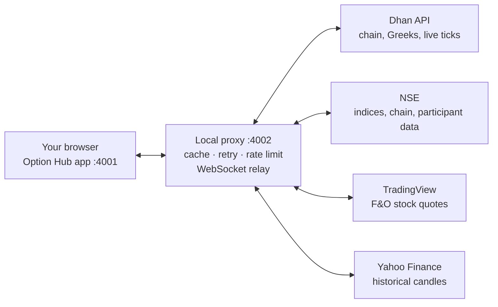

<div align="center">

<a href="https://mrchartist.com/open-source/india-s-best-option-hub?utm_source=github&utm_medium=readme&utm_campaign=option-hub">
  <picture>
    <source media="(prefers-color-scheme: dark)" srcset="docs/brand/logo-white.svg">
    
  </picture>
</a>

# Option Hub by Mr. Chartist

**India's open-source options terminal for NSE and BSE F&O.**<br>
Option chain, OI, max pain, GEX, volatility, flow, strategy builder, optimizer, backtester and paper trading, in one free app that runs on your own computer.

[](https://github.com/MrChartist/india-s-best-option-hub/actions/workflows/ci.yml)
[](LICENSE)
[](#quality)
[](#built-for-indian-markets)
[](https://github.com/MrChartist/india-s-best-option-hub/stargazers)

[**Quick start**](#quick-start) · [**Feature tour**](#feature-tour) · [**Screenshots**](#screenshots) · [**Data sources**](#data-sources) · [**More from Mr. Chartist**](#more-from-mr-chartist)

<br>


</div>

---

## Why Option Hub

Most serious options tools for Indian traders sit behind a monthly fee. The best analytics in the world, such as GEX, IV surfaces, flow scanners and strategy optimisers, are built for the US market. Option Hub brings both together for NSE and BSE, and keeps it free and open source.

- **Numbers you can trust.** Every price, IV and Greek comes from one tested maths library (Black-76 on the forward, time measured to 15:30 IST, real lot sizes and expiry rules). More than 1,400 unit tests check it.
- **Honest about data.** Every number carries its source: Live, Delayed, Last saved or **Sample**. If the data feed is off, the app says so on every page. It never presents made-up numbers as live.
- **Private by design.** It runs on your machine. Your broker keys stay in your browser and your local proxy. There is no cloud account, no tracking and no sign-up.
- **Built for how Indians trade.** It covers weekly expiries, lakh and crore formatting, IST everywhere, FII/DII participant data, F&O ban list, STT and charges, and SEBI's risk reminders.
- **Teaches while you trade.** Inline explainers on every metric and a Learn hub built with [NISMExams.com](https://nismexams.com?utm_source=github&utm_medium=readme&utm_campaign=option-hub).

> Data for education and research. Not investment advice.

---

## Feature tour

| Area | Pages | What you get |
|---|---|---|
| **Markets** | Dashboard · Watchlist · Events Calendar | Indices, India VIX, daily market brief, positioning summary, customisable layout, results and macro events |
| **Chain & OI** | Option Chain · OI Analysis · Max Pain & PCR · F&O Screener · Expiry Day · Straddles · Contract | Greeks, OI build-up labels (LB / SB / SC / LU), ATM focus, strike range, volume spikes, max pain curve, PCR history, buildup scanner, 0DTE command centre, straddle and strangle charts, per-contract history |
| **Volatility** | Volatility | IV rank and percentile, smile, term structure, volatility cone, expected move, India VIX analytics, symbol compare |
| **Positioning** | Gamma Exposure · Options Flow · FII / DII Positioning · Futures & Rollover | GEX profile, call and put walls, gamma flip, DEX / VEX / CEX, derived flow tape, unusual activity, participant-wise OI, rollover and basis |
| **Strategy** | Strategy Builder · Optimizer · Backtester · Calculators | Multi-leg payoff with target-date and IV sliders, lognormal POP, margin and charges estimate, strategy optimizer by view and budget, backtests on past expiries, charges, margin, position size, option price and IV calculators |
| **Portfolio** | Positions · Paper Trading · Trade Journal · Alerts | Live P&L and Greeks, paper trading with a real order ticket, tradebook import and analytics, price, IV, PCR and OI alerts |
| **Learn** | Learn · Mr. Chartist ecosystem | Lessons from options basics to dealer gamma, quizzes and simulators, links to every Mr. Chartist product |

Press <kbd>Ctrl</kbd> <kbd>K</kbd> anywhere to jump to any page or symbol, and <kbd>?</kbd> to see every keyboard shortcut.

---

## Screenshots

All screenshots were taken in **sample-data mode** (no data feed connected), which is exactly what you see on first run. Live numbers replace them once the local proxy is running.

### Chain & OI

| Option Chain | OI Analysis |
|---|---|
|  |  |
| **Max Pain & PCR** | **F&O Screener** |
|  |  |
| **Expiry Day (0DTE)** | **Straddles** |
|  |  |

### Volatility and positioning

| Volatility | Gamma Exposure |
|---|---|
|  |  |
| **Options Flow** | **FII / DII Positioning** |
|  |  |
| **Futures & Rollover** | **Events Calendar** |
|  |  |

### Strategy

| Strategy Builder | Optimizer |
|---|---|
|  |  |
| **Backtester** | **Calculators** |
|  |  |

### Portfolio and learning

| Positions | Paper Trading |
|---|---|
|  |  |
| **Trade Journal** | **Alerts** |
|  |  |
| **Learn (with NISMExams.com)** | **Watchlist** |
|  |  |

<details>
<summary><strong>Light mode</strong> (click to open)</summary>

<br>

| Dashboard | Option Chain |
|---|---|
|  |  |
| **Strategy Builder** | **Gamma Exposure** |
|  |  |
| **Volatility** | **Max Pain & PCR** |
|  |  |
| **F&O Screener** | **Calculators** |
|  |  |
| **Learn** | **Mr. Chartist ecosystem** |
|  |  |

Every page has a light version in [`docs/screenshots/`](docs/screenshots).

</details>

<details>
<summary><strong>Mobile</strong> (click to open)</summary>

<br>

<p align="center">
  
  
  
  
</p>

</details>

---

## Quick start

You need **Node.js 20 or newer** ([download the LTS version](https://nodejs.org/)), this project, and a browser. Nothing is hosted; everything runs on your computer.

### No coding experience? Follow these steps

<details open>
<summary><strong>Windows</strong></summary>

1. Install Node.js LTS from [nodejs.org](https://nodejs.org/).
2. On this page, click **Code → Download ZIP**, then extract the ZIP.
3. Open the extracted folder. Click the address bar, type `cmd` and press **Enter**.
4. In the black window, type `npm install` and press **Enter**. Wait for it to finish.
5. Type `npm run dev` and press **Enter**.
6. Open **http://localhost:4001** in Chrome, Edge or Brave.

</details>

<details>
<summary><strong>Mac</strong></summary>

1. Install Node.js LTS from [nodejs.org](https://nodejs.org/).
2. On this page, click **Code → Download ZIP**, then double-click the ZIP to extract it.
3. Open **Terminal**. Type `cd ` (with a space), drag the project folder into the window and press **Enter**.
4. Run `npm install`, then `npm run dev`.
5. Open **http://localhost:4001** in Safari, Chrome or Brave.

</details>

Keep the window open while you use the app. Press <kbd>Ctrl</kbd> <kbd>C</kbd> in it to stop.

### For developers

```bash
git clone https://github.com/MrChartist/india-s-best-option-hub.git
cd india-s-best-option-hub
npm install
npm run dev          # app on :4001 and local data proxy on :4002
```

That is all you need. Without broker keys the app still runs, with NSE and public data where available, and clearly labelled sample data where not.

### Optional: add Dhan for real-time chains and Greeks

A free [Dhan API](https://dhanhq.co/docs/v2/) key gives you the best option chain, Greeks and live WebSocket ticks. Either enter it in the app under **Broker Settings**, or put it in a `.env` file:

```bash
cp .env.example .env
# then set DHAN_CLIENT_ID and DHAN_ACCESS_TOKEN
```

### Run with Docker

```bash
docker compose up --build      # open http://localhost:4001
```

Ports are bound to `127.0.0.1` only, because the proxy can hold your broker token. Your `.env` file is read at runtime and never copied into the image.

---

## Data sources


```mermaid
flowchart LR
  B["Your browser<br/>Option Hub app :4001"] <--> P["Local proxy :4002<br/>cache · retry · rate limit<br/>WebSocket relay"]
  P <--> D["Dhan API<br/>chain, Greeks, live ticks"]
  P <--> N["NSE<br/>indices, chain, participant data"]
  P <--> T["TradingView<br/>F&O stock quotes"]
  P <--> Y["Yahoo Finance<br/>historical candles"]
```

| Source | Provides | Key needed |
|---|---|---|
| **Dhan API** | Option chain, Greeks, expiry list, live WebSocket ticks | Yes (free) |
| **NSE** | Indices, sectors, advance/decline, option chain fallback, participant-wise OI, bhavcopy | No |
| **TradingView** | F&O stock prices and volumes | No |
| **Yahoo Finance** | Historical OHLCV candles for charts | No |

**How the labels work.** The badge on each card tells you where its number came from:

| Badge | Meaning |
|---|---|
| **Live** | Streaming or freshly fetched during market hours |
| **Delayed** | From a source that lags by a few seconds to minutes |
| **Last saved** | The last good value, kept from your local history |
| **Sample** | Generated for demonstration when no feed is connected. Never a real price |
| **Derived** | Calculated by the app (for example flow from chain snapshots, or IV from price) |

**Security.** The proxy listens on `127.0.0.1` only and accepts requests from your local app only. It checks the host and origin of each request. Your keys are kept per connection and never logged. Set `VITE_DATA_MODE=sample` to skip the proxy completely.

---

## Built for Indian markets

| Topic | How Option Hub handles it |
|---|---|
| **Expiry calendar** | NIFTY weekly on Tuesday, SENSEX weekly on Thursday, other indices and stocks monthly. If expiry falls on a holiday, it moves to the previous trading day |
| **Time to expiry** | Measured to 15:30 IST to the minute, not in whole days |
| **Lot sizes** | Per-contract history, so older contracts keep their old lot size |
| **Pricing** | Black-76 on the forward from put-call parity, with an IV solver that refuses impossible prices |
| **Charges** | Dated tables for STT (including STT on exercise), exchange charges, SEBI fee, stamp duty and GST |
| **Margin** | A SPAN-style 16-scenario estimate with exposure margin and hedge benefit. Always labelled as an estimate |
| **Formatting** | ₹, lakh and crore, IST everywhere, and the Indian CE/PE colour convention |

> Lot sizes, holiday lists and charge rates change through exchange and SEBI circulars. They live in [`src/lib/options/`](src/lib/options), each value is marked for verification, and you can correct them in one place.

---

## Keyboard shortcuts

| Keys | Action |
|---|---|
| <kbd>Ctrl</kbd> <kbd>K</kbd> | Command palette: pages, indices and F&O stocks |
| <kbd>?</kbd> | Show all shortcuts |
| <kbd>R</kbd> | Refresh data |
| <kbd>G</kbd> then <kbd>D</kbd> | Dashboard |
| <kbd>G</kbd> then <kbd>C</kbd> | Option Chain |
| <kbd>G</kbd> then <kbd>O</kbd> | OI Analysis |
| <kbd>G</kbd> then <kbd>V</kbd> | Volatility |
| <kbd>G</kbd> then <kbd>X</kbd> | Gamma Exposure |
| <kbd>G</kbd> then <kbd>F</kbd> | Options Flow |
| <kbd>G</kbd> then <kbd>S</kbd> | Strategy Builder |
| <kbd>G</kbd> then <kbd>P</kbd> | Positions |
| <kbd>G</kbd> then <kbd>L</kbd> | Learn |

---

## Tech stack

**React 18** · **TypeScript** · **Vite** · **Tailwind CSS** with shadcn/ui and Radix · **Recharts** and Lightweight Charts · **TanStack Query** · **IndexedDB** for local history · **Workbox PWA** (installable, works offline for the app shell) · **Node.js** proxy with WebSocket relay · **Vitest**, **Playwright** and **axe** for testing.

<details>
<summary><strong>Project structure</strong></summary>

```
├── proxy-server.mjs        Local data proxy (Dhan, NSE, TradingView, Yahoo) on :4002
├── src/
│   ├── pages/              One file per route
│   ├── components/         UI by feature (option-chain, strategy, gex, flow, volatility, …)
│   │   ├── ui/             Design-system primitives (shadcn/ui, Mr. Chartist theme)
│   │   └── brand/          Official Mr. Chartist logo
│   ├── lib/
│   │   ├── options/        Pricing, Greeks, IV, IST calendar, lot sizes, payoff, POP, charges, margin
│   │   ├── routes.ts       Route registry: drives routing, sidebar, command palette, shortcuts
│   │   ├── brand/          Product links and UTM helper
│   │   └── …               Feature logic (screener, flow, gex, backtest, journal, alerts, …)
│   ├── content/learn/      Learn hub lessons
│   └── hooks/              Data, theme and shortcut hooks
├── e2e/                    Playwright smoke and accessibility tests
└── docs/                   Architecture, data endpoints, screenshots, brand assets
```

See [`docs/ARCHITECTURE.md`](docs/ARCHITECTURE.md) and [`docs/DATA_ENDPOINTS.md`](docs/DATA_ENDPOINTS.md) for details, and [`ROADMAP.md`](ROADMAP.md) for what is next.

</details>

<details>
<summary><strong>Scripts</strong></summary>

| Command | What it does |
|---|---|
| `npm run dev` | App on :4001 and proxy on :4002 |
| `npm run dev:vite` | App only (sample or cached data) |
| `npm run proxy` | Proxy only |
| `npm run build` / `npm run preview` | Production build and local preview |
| `npm run typecheck` | TypeScript checks for app, Node config and e2e |
| `npm run lint` | ESLint |
| `npm test` / `npm run test:coverage` | Unit tests, with coverage gates |
| `npm run test:e2e` | Playwright smoke and accessibility tests (desktop and 375 px) |
| `npm run check` | Typecheck, lint, test and build in one go |

</details>

---

## Quality

- **1,400+ unit tests** with Vitest. The options maths library has a hard 90% coverage gate, and there is a global coverage ratchet.
- **Browser tests** with Playwright on every page, at desktop width and at 375 px, in light and dark mode.
- **Accessibility checks** with axe on every page: no serious WCAG violations allowed.
- **CI on every pull request**: typecheck, lint, unit tests with coverage, build, browser tests, a proxy health check and a dependency audit.

---

## Troubleshooting

<details>
<summary><strong>The app shows "Sample data" everywhere</strong></summary>

The local proxy is not reachable. Start the app with `npm run dev` (not `npm run dev:vite`), then check **http://localhost:4002/health** in your browser. Outside market hours and on holidays, NSE and brokers often return empty data. That is normal.
</details>

<details>
<summary><strong>Port 4001 or 4002 is already in use</strong></summary>

For the proxy, set `PROXY_PORT=4003` in `.env` and `VITE_PROXY_URL=http://localhost:4003`. For the app, change `server.port` in `vite.config.ts`.
</details>

<details>
<summary><strong>The option chain or live ticks do not load</strong></summary>

The richest chain and the WebSocket feed need Dhan credentials. Check **Broker Settings**, and look at `websocket.dhanConnected` on the `/health` page. The feed reconnects on its own with back-off.
</details>

<details>
<summary><strong>npm install fails</strong></summary>

Check `node --version` shows 20 or newer. Then run `npm cache clean --force` and `npm install` again.
</details>

---

## Contributing

Pull requests are welcome. Please read [CONTRIBUTING.md](CONTRIBUTING.md), keep all maths in `src/lib/options`, label sample or derived data, and run `npm run check` before you push. Good first areas: more broker relays, verified lot-size and holiday updates, more Learn lessons, and translations.

Found a bug or have an idea? [Open an issue](https://github.com/MrChartist/india-s-best-option-hub/issues).

---

## More from Mr. Chartist

Option Hub is one part of the [Mr. Chartist ecosystem](https://mrchartist.com/ecosystem?utm_source=github&utm_medium=readme&utm_campaign=option-hub): tools, research and education for Indian markets, built around one price-action workflow.

| Product | What it is |
|---|---|
| [**FII/DII Data**](https://fii-diidata.mrchartist.com?utm_source=github&utm_medium=readme&utm_campaign=option-hub) | Track FII and DII institutional money flows, F&O positioning, sector-wise FPI allocation and flow heatmaps |
| [**IPO Decode**](https://ipodecode.mrchartist.com?utm_source=github&utm_medium=readme&utm_campaign=option-hub) | Every mainboard and SME IPO on NSE and BSE: subscription, grey market premium, allotment status and listing performance |
| [**TradeBook**](https://tradebook.mrchartist.com?utm_source=github&utm_medium=readme&utm_campaign=option-hub) | Trading journal for Indian markets: NSE, MCX and F&O |
| [**NISM Exams**](https://nismexams.com?utm_source=github&utm_medium=readme&utm_campaign=option-hub) | Notes, mock tests, explanations and performance tracking for NISM Series V-A, VIII, XV, X-A, X-B, XXI-A and XXI-B |
| [**Weekly ChartBook**](https://mrchartist.com/research/category/chartbook?utm_source=github&utm_medium=readme&utm_campaign=option-hub) | 280+ editions of visual chart analysis with actionable setups |
| [**Trading Books**](https://mrchartist.com/books?utm_source=github&utm_medium=readme&utm_campaign=option-hub) | *Trading Candlestick Patterns* and *Trading Chart Patterns*, two price-action books with real NSE and BSE examples |
| [**OptionsDesk**](https://optionsdesk.mrchartist.com?utm_source=github&utm_medium=readme&utm_campaign=option-hub) | More options tools from Mr. Chartist |
| [**FundaDesk**](https://funda.mrchartist.com?utm_source=github&utm_medium=readme&utm_campaign=option-hub) | Fundamentals tools from Mr. Chartist |
| [**Investology**](https://investology.mrchartist.com/?utm_source=github&utm_medium=readme&utm_campaign=option-hub) | SEBI-registered research from Mr. Chartist |
| [**Learn**](https://mrchartist.com/learn?utm_source=github&utm_medium=readme&utm_campaign=option-hub) | Free courses on options, technical analysis, TradingView, NISM and more |

**Follow for market views:**
[X / Twitter](https://x.com/Mr_Chartist) ·
[YouTube](https://www.youtube.com/mr_chartist) ·
[Telegram](https://t.me/official_mrchartist) ·
[WhatsApp channel](https://whatsapp.com/channel/0029VaDUeH159PwXDwq8yI1I) ·
[Instagram](https://instagram.com/mrchartist) ·
[LinkedIn](https://www.linkedin.com/in/rohit-mrchartist/) ·
[TradingView](https://tradingview.com/u/MrChartist) ·
[GitHub](https://github.com/MrChartist)

Built by **Rohit Singh (Mr. Chartist)**. INVESTOLOGY · SEBI Registered Research Analyst — INH000015297 ([verify on SEBI](https://www.sebi.gov.in/sebiweb/other/OtherAction.do?doRecognisedFpi=yes&intmId=14&regno=INH000015297)).

---

## Disclaimer

Option Hub is for **education and research only**. It is **not investment advice** and not a recommendation to buy or sell any security.

- Trading in derivatives carries substantial risk. A SEBI study found that about 9 in 10 individual F&O traders lost money between FY22 and FY24.
- Sample, derived and estimated values (including margin) are approximations. Check them with your broker before you trade.
- Do your own research, and consult a SEBI-registered adviser where needed.
- Your API keys stay on your machine. The authors are not responsible for any trading losses.

## License

[MIT](LICENSE). Free to use, change and share. Please keep the licence notice.

<div align="center">

<br>

**If Option Hub helps your trading or learning, please give it a ⭐. It helps other Indian traders find it.**

<a href="https://mrchartist.com?utm_source=github&utm_medium=readme&utm_campaign=option-hub">mrchartist.com</a> · A clearer view of the markets.

</div>
